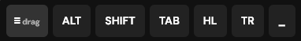

** Mobile Power Overlay **
**A lightweight browser extension that provides floating modifier buttons
(ALT, SHIFT, TAB, Highlight, Translate) for better mobile and desktop web interaction.**

**The overlay is draggable, remembers its position, and shows highlight/translate
controls only when text is selected.**
[overlay.bmp](overlay.bmp) 

**Features**

- Floating overlay
- ALT modifier
- SHIFT modifier
- TAB navigation
- Text highlight
- Google Translate shortcut
- Draggable interface
- Position memory
- Mobile touch support
- Selection-based controls
- Minimize and restore

**Installation**

1. Download or clone the repository
2. Open Chrome
3. Go to chrome://extensions
4. Enable Developer Mode
5. Click Load unpacked
6. Select the extension folder

**Usage**
ALT → special characters
SHIFT → uppercase / symbols
TAB → switch input fields
HL → highlight selected text
TR → translate selected text
\_ → minimize overlay
≡ → drag or restore overlay

**Project Structure**
manifest.json
content.js
overlay.css
background.js
README.md
16.png
48.png
128.png

**License**
MIT
